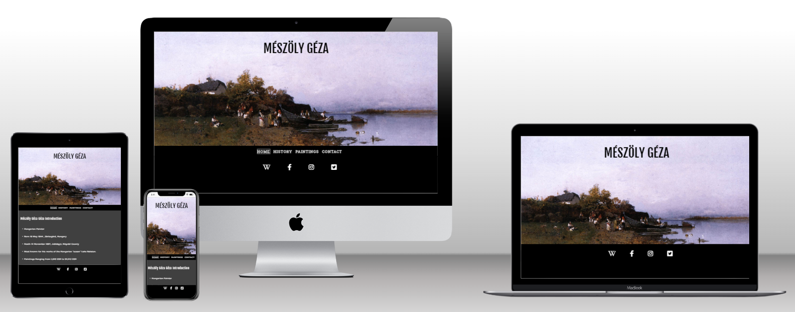
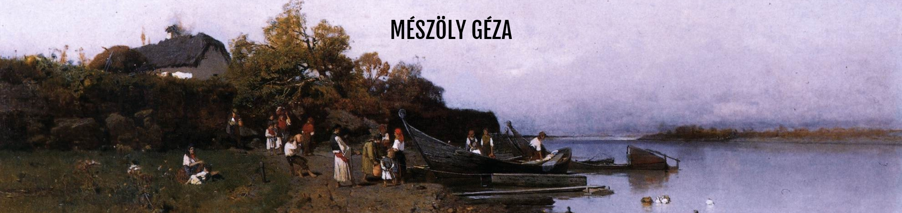
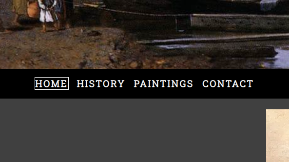
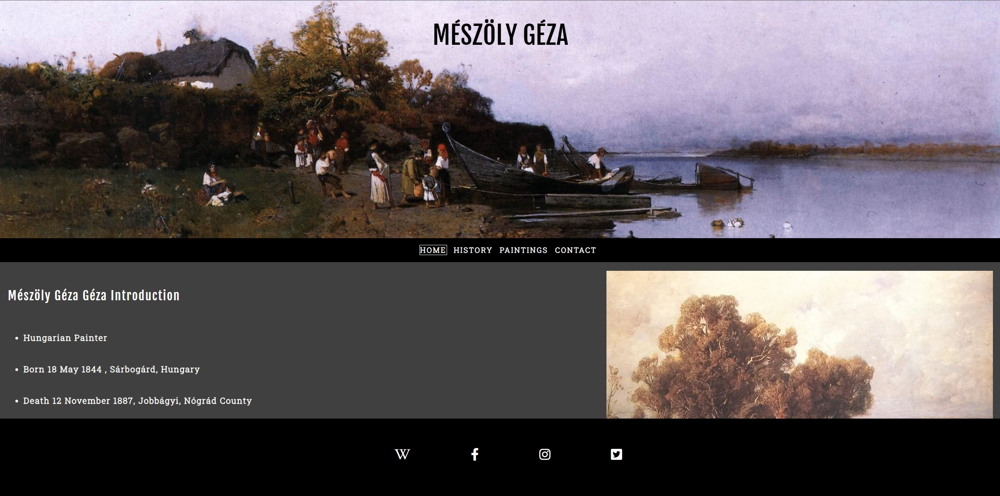
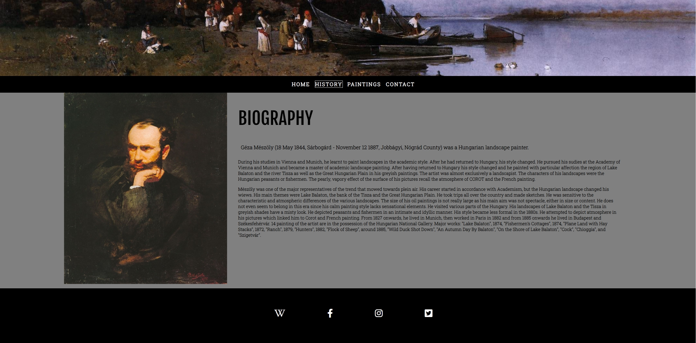
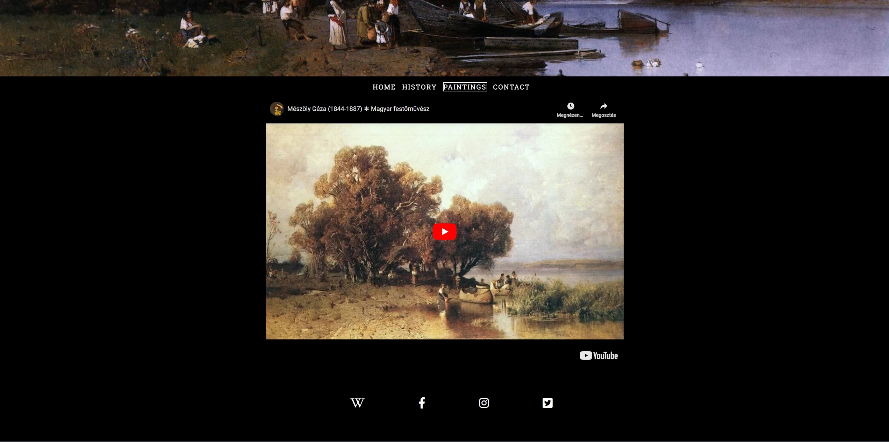
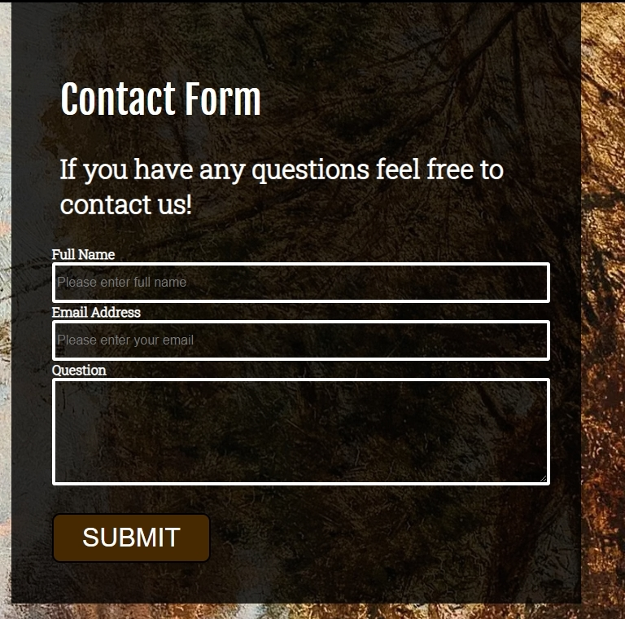
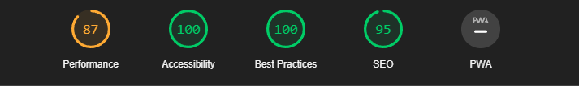
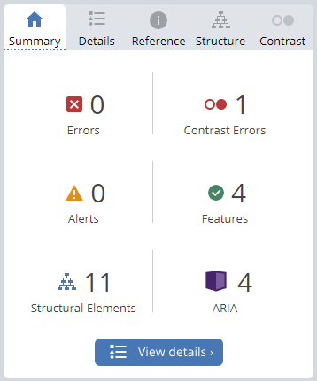

# MÉSZÖLY GÉZA History Website
The Mészöly Géza history website presents relevant information about the painters life and helps people get acquainted with the painters works.
Users of this website will easy find the information they need with the help of the navigation menu, to navigate through the Home where they will find quick easy to process information about the painter, History more in depth about the Mészäly Géza’s life , Paintings where they will find a Youtube video with Mészöly Gézas painting,  and Contact for questions and where to find some of the paintings to look at. This site it directed at people interested about Mészöly Géza and his paintings .
[click here for live website!](https://balintbakos78.github.io/Historywebsite_Project_1/)

## Features

## Existing Features

### 1. Header
- Featured on all pages includes with a nice Painting and contains The page Title

### 2. Navigation Bar

- Featured on all pages includes links HOME, HISTORY, PAINTINGS, CONTACT pages to allow for easy navigation.
- Allows the user to navigate between pages without the need to use the back button and has clear visual marker on which page they currently are on. 

### 3. Landing Page
- Short information about the painter and a painting of the Lake Balaton (One of his most known paintings.)

### 4. Page footer
- This will contain icons as links to social media websites that will open in new tabs. Icons will be accessible to the visually impaired who may be using a screen reader, by the use of aria labels.
- This will allow the user to check the wikipedia, and social media Pages for the painter. 

### 5. History Page
- Allows the User to gather more information about the painter. 

### 6. Paintings Page
- Allows the user to play a youtube video and to view the artworks of the painter.
- Allow fullscreen is on and video won't autoplay. 
- Video controls are disabled 

### 7. Contact Form
- Allows the Use to contact the site owner with additional questions.
  - First Name (required, type=text)  
    Last Name (required, type=text)  
    Email (required, type=email)  
    Message (required, type=textarea)

    

### 8. Google Maps
- Provides the User with a google map to the art gallery where they can find some of the paintings.

## Features Left to Implement
- Message after submitting the contact form. 

## Technologies
- HTML
  - The structure of the Website was developed using HTML as the main language.
- CSS
  - The Website was styled using custom CSS in an external file.
- GitHub
  - Source code is hosted on GitHub and delpoyed using Git Pages.
- Git
  - Used to commit and push code during the development opf the Website
- Font Awesome
  - Icons obtained from https://fontawesome.com/ were used as the Social media links in the footer section.
- Tinyjpg
  - https://tinyjpg.com/ was used to reduce the size of the images used throughout the website

## Testing

### Responsivness

Steps to test:

1. Open browser and navigate to Tacos Travels
2. Open the developer tools (right click and inspect)
3. Set to responsive and decrease width to 320px
4. Set the zoom to 50%
5. Click and drag the responsive window to maximum width

Website is responsive on all screen sizes and no images are pixelated or stretched. No horizontal scroll is present. No elements overlap.

Website was also opened on the following devices without any issue.:

Iphone 13 Pro (safari Browser)
Samsung galaxy s21 (Chrome Browser)
Desktop (Microsoft Edge Browser)
Laptop (Chrome Browser)
10" Tablet (Chrome Browser)

### Lighthouse Testing

### Accessibility

- [Wave Accessibility](https://wave.webaim.org/). was used to check accessibility, 1 contrast error returned in the header.

### Validator Testing

- HTML
  - No errors were returned when passing through the official W3C validator

- CSS
  -  No errors were found when passing through the official (Jigsaw) validator

  

## Deployment

### - Deployment to Github Pages
  - The site was deployed to GitHub pages. The steps to deploy are as follows:
  - In the GitHub repository, navigate to the Settings tab
  - From the menu on left select 'Pages'
  - From the source section drop-down menu, select the Branch: main
  - Click 'Save'
  - A live link will be displayed in a green banner when published successfully.

 

The live link can be found here - https://balintbakos78.github.io/Historywebsite_Project_1/

## Credits

### Content
- The text content on the history was taken from Budapest Actions website. https://budapestauction.com/geza-meszoly/painter
- The implementation of display type flex was implemented by the help of the website flexboxfroggy [FlexBoxFroggy](https://flexboxfroggy.com/)
- The icons in the footer were taken from [Font Awesome](https://fontawesome.com/)

### Media
- Images were taken from the [Géza Mészöly Wikipedia page ](https://en.wikipedia.org/wiki/G%C3%A9za_M%C3%A9sz%C3%B6ly_%28painter%29) and [Wikimedia](https://commons.wikimedia.org/wiki/File:G%C3%A9za_M%C3%A9sz%C3%B6ly_Weite_Landschaft_im_Abendlicht_1877.jpg)
- Youtube video from K A R O L A youtube channel [Mészöly Géza (1844-1887) ✽ Magyar festőművész](https://www.youtube.com/watch?v=7rOHg4kRF8c&t=5s)